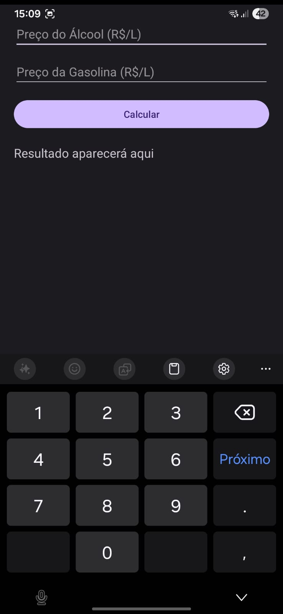
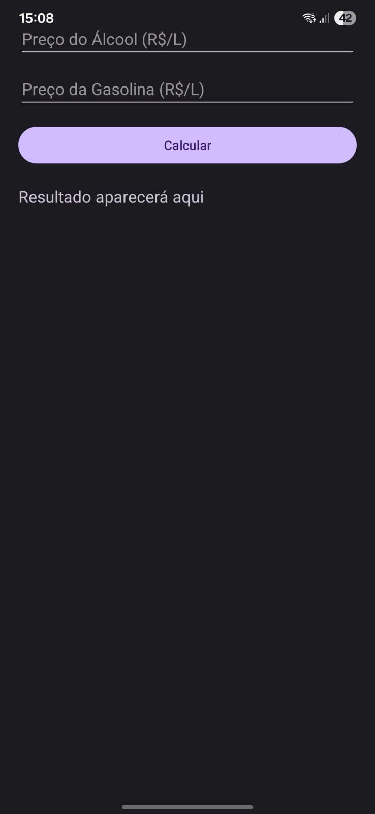

# 📱 App Cálculo de Combustível

Aplicativo Android desenvolvido em Kotlin que calcula qual combustível é mais vantajoso (Etanol ou Gasolina).

## 🚀 Funcionalidades

- Entrada do preço do etanol
- Entrada do preço da gasolina
- Cálculo automático baseado na regra dos 70%
- Exibição do combustível mais vantajoso

## 🎥 Demonstração do App

Clique no link abaixo para assistir ao vídeo:

👉 https://youtube.com/shorts/jyYvuQA9dxE?feature=shared

## 📷 Preview do App

## 🛠 Tecnologias utilizadas

- Kotlin
- Android Studio
- XML (LinearLayout)
- Git e GitHub
